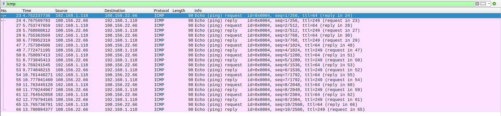
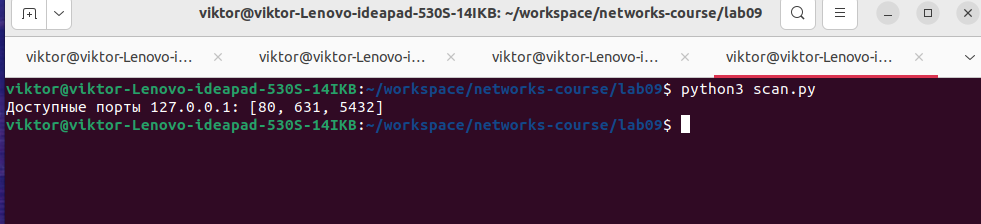

# Практика 9. Сетевой уровень

## Wireshark: ICMP
В лабораторной работе предлагается исследовать ряд аспектов протокола ICMP:
- ICMP-сообщения, генерируемые программой Ping
- ICMP-сообщения, генерируемые программой Traceroute
- Формат и содержимое ICMP-сообщения

### 1. Ping (4 балла)
Программа Ping на исходном хосте посылает пакет на целевой IP-адрес; если хост с этим адресом
активен, то программа Ping на нем откликается, отсылая ответный пакет хосту, инициировавшему
связь. Оба этих пакета Ping передаются по протоколу ICMP.

Выберите какой-либо хост, расположенный на другом континенте (например, в Америке или
Азии). Захватите с помощью Wireshark ICMP пакеты от утилиты ping.
Для этого из командной строки запустите команду (аргумент `-n 10` означает, что должно быть
отослано 10 ping-сообщений): `ping –n 10 host_name`

Для анализа пакетов в Wireshark введите строку icmp в области фильтрации вывода.

#### Вопросы
1. Каков IP-адрес вашего хоста? Каков IP-адрес хоста назначения?
   - 192.168.1.118 - мой
   - 108.156.22.66 - назначения
2. Почему ICMP-пакет не обладает номерами исходного и конечного портов?
   - ICMP не протокол транспортного уровня.
3. Рассмотрите один из ping-запросов, отправленных вашим хостом. Каковы ICMP-тип и кодовый
   номер этого пакета? Какие еще поля есть в этом ICMP-пакете? Сколько байт приходится на поля 
   контрольной суммы, порядкового номера и идентификатора?
   - Type: 8 (Echo (ping) request)
   - Code: 0
   - Checksum: 0x4698 [correct], **2 bytes**
   - Identifier (BE): 4 (0x0004), **2 bytes**
   - Identifier (LE): 1024 (0x0400)
   - Sequence Number (BE): 1 (0x0001), **2 bytes**
   - Sequence Number (LE): 256 (0x0100)
   - Timestamp from icmp data: Apr 16, 2024 23:33:22.000000000 MSK
   - Data (48 bytes)

4. Рассмотрите соответствующий ping-пакет, полученный в ответ на предыдущий. 
   Каковы ICMP-тип и кодовый номер этого пакета? Какие еще поля есть в этом ICMP-пакете? 
   Сколько байт приходится на поля контрольной суммы, порядкового номера и идентификатора?
   - Type: 0 (Echo (ping) reply)
   - Code: 0
   - Checksum: 0x4e98 [correct]
   - Identifier (BE): 4 (0x0004)
   - Identifier (LE): 1024 (0x0400)
   - Sequence Number (BE): 1 (0x0001)
   - Sequence Number (LE): 256 (0x0100)
   - [Response time: 15,322 ms], **это поле добавилось**
   - Timestamp from icmp data: Apr 16, 2024 23:33:22.000000000 MSK
   - Data (48 bytes)
   На поля приходится столько же байт, как и в запросе

## Программирование.

### 1. IP-адрес и маска сети (1 балл)
Напишите консольное приложение, которое выведет IP-адрес вашего компьютера и маску сети на консоль.

#### Демонстрация работы

### 2. Доступные порты (2 балла)
Выведите все доступные (свободные) порты в указанном диапазоне для заданного IP-адреса. 
IP-адрес и диапазон портов должны передаваться в виде входных параметров.

#### Демонстрация работы

